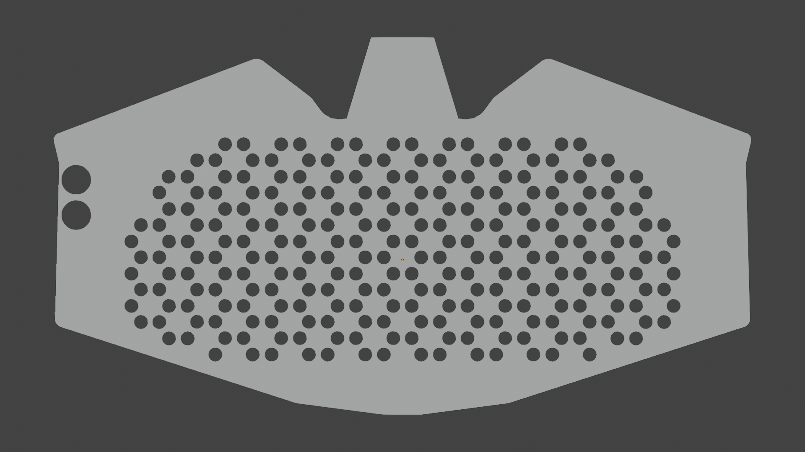
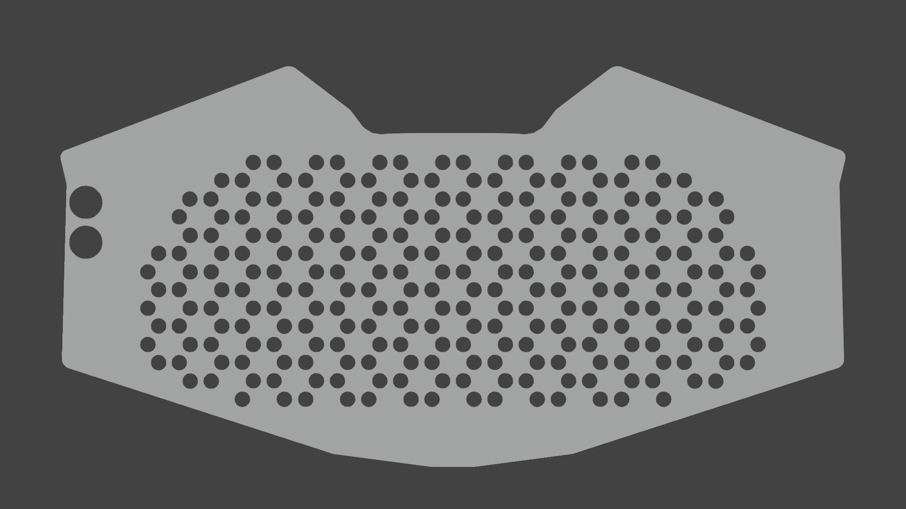
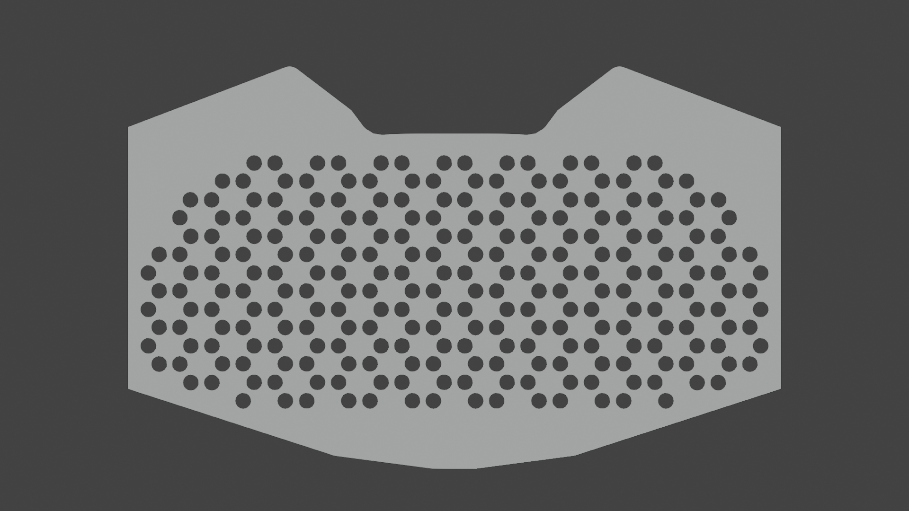

# Boop Blocker Shield

This is a simple "shield" for the 2020 DCFurs badge (the "Boop Blocker"). It is meant to protect the LEDs so they don't pop off, as was common in 2018's badge. It's 3D printable, and with the right settings can be printed with more rigid materials like PLA, rather than TPU.

It comes in three variants: Full, No Nose, and Compact.

https://www.thingiverse.com/thing:4739247

## Variants

### Full

Covers every bit of the badge, with cutouts for the LEDs and animation cycle buttons.

### No Nose

Same as Full, but it does not cover the nose area of the badge.

### Compact

Same as No Nose, but with the sides cut off, so it only covers the area necessary to protect the LEDs. Good for printers with small build volume.

## Printing

I recommend that if you have a flexible material such as TPU that you print with it. But if you don't, it is still possible to print with more rigid materials like PLA, and still be flexible.

The STLs provided are pretty thin (6mm), and should be sufficiently thin to provide flexibility. But by tweaking your slicer's settings, you should be able to get an optimal result. Try adjusting settings like infill density and number of walls/shells to get a good balance between flexibility and protection. You can also adjust the thickness in your slicer once you import the STL. Basically, just play with the settings until you get something good!

Once you have printed the shield, I recommend using a thick double-sided adhesive to mount it.

## .blend File

The source `.blend` file is provided if you want to make your own customizations or contribute something (a better mounting mechanism, maybe? PRs welcome!)

To switch between the variants, go to each of the labeled frames in the scene. Each will enable/disable the necessary properties to see the correct variant.
